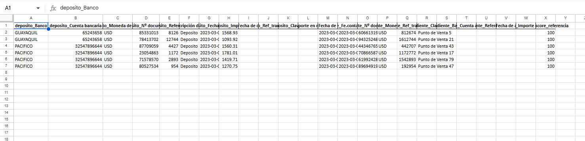

# Depuración Masiva de Registros Bancarios

Herramienta de conciliación bancaria de alta precisión: Automatización escalable con Python que combina cruce exacto y lógica difusa para optimizar procesos contables con alta transaccionalidad.

---
## Desafío Operativo y Valor de la Solución

- **El Problema**
La conciliación bancaria manual es un proceso propenso a errores y costoso en términos de tiempo, especialmente cuando existen inconsistencias en el registro de referencias transaccionales (errores de digitación, omisión de caracteres o formatos variables). En volúmenes de datos masivos, un cruce exacto estándar deja un alto porcentaje de transacciones como "pendientes", obligando al equipo contable a realizar una revisión fila por fila para identificar coincidencias que, aunque evidentes al ojo humano, son invisibles para los sistemas tradicionales.

- **La Solución y su Escalabilidad**
Este proyecto implementa una arquitectura de limpieza y conciliación automatizada en Python que trasciende el cruce exacto mediante el uso de lógica difusa (Fuzzy Matching). La solución aporta escalabilidad al introducir un "embudo de procesamiento": primero resuelve de forma masiva los cruces directos y, posteriormente, aplica inteligencia algorítmica sobre el residuo de excepciones, validando simultáneamente integridad de montos y similitud de referencias. Este enfoque reduce drásticamente la carga operativa manual, garantiza la trazabilidad del dato y permite procesar miles de registros en segundos, adaptándose fácilmente a diferentes estructuras bancarias o incrementos en el volumen de operaciones sin perder precisión.

---
## Descripción del proceso 

El proceso de conciliación bancaria comparan el mayor contable de la empresa contra el estado de cuenta bancario. Utiliza dos capas de matching para maximizar las coincidencias:

- **Capa 1 — Merge exacto:** Cruza registros donde la referencia y el importe coinciden perfectamente.
- **Capa 2 — Fuzzy Matching:** Detecta coincidencias donde las referencias tienen pequeñas diferencias de formato (espacios, guiones, ceros, mayúsculas/minúsculas), pero corresponden al mismo movimiento.

El resultado final es un archivo Excel con 6 pestañas que resume todo el estado de la conciliación
 
---

## 🗂️ Estructura del proyecto

```
Depuracion_Masiva_de_Registros_Bancarios/
│
├── data/
│   ├── raw/
│   │   ├── mayor_contable.xlsx      # Mayor contable de la empresa
│   │   └── estado_cuenta.xlsx       # Estado de cuenta bancario (2 pestañas: Guayaquil, Pacífico)
│   └── processed/
│       └── conciliacion_resultado.xlsx   # Archivo final (se genera automáticamente)
│
├── image/                           # Capturas de referencia usadas en este README
│
├── log/
│   └── conc.log                     # Log de ejecución (se genera automáticamente)
│
├── src/
│   ├── project_config.py            # Rutas y constantes del proyecto
│   ├── bank_reconciliation.py        # Carga de datos, cruce exacto y fuzzy matching
│   ├── excel_exporter.py            # Exportación del Excel final con formato
│   ├── logging_config.py            # Configuración del logging
│
├── main.py                          # Punto de entrada: orquesta todo el flujo
├── requirements.txt                 # Dependencias del proyecto
├── .gitignore
└── README.md                        # Este archivo
```

---

## 🚀 Instalación y ejecución

### Requisitos previos
- Python 3.10 o superior

### Pasos

1. **Clonar el repositorio**
   ```bash
   git clone https://github.com/Fabricio-BI/Depuracion_Masiva_de_Registros_Bancarios.git
   cd Depuracion_Masiva_de_Registros_Bancarios
   ```

2. **Crear y activar un entorno virtual**
   ```bash
   python -m venv .venv

   # Linux / macOS
   source .venv/bin/activate

   # Windows
   .venv\Scripts\activate
   ```

3. **Instalar las dependencias**
   ```bash
   pip install -r requirements.txt
   ```

4. **Verificar los datos de entrada**
   Los archivos de prueba ya están incluidos en `data/raw/`:
   - `mayor_contable.xlsx`
   - `estado_cuenta.xlsx`

   Si quieres usar tus propios datos, reemplaza estos archivos manteniendo el mismo nombre y estructura de columnas (ver sección "Estructura de los archivos" más abajo).

5. **Ejecutar el proceso**
   ```bash
   python main.py
   ```

   La carpeta `data/processed/` se crea automáticamente si no existe.

6. **Revisar el resultado**
   El archivo `data/processed/conciliacion_resultado.xlsx` se genera con las 6 pestañas descritas en este README.

---

## 📁 Nota sobre los datos de ejemplo
Los conjuntos de datos incluidos en este repositorio han sido generados de manera ficticia para simular un escenario operativo real de una empresa con alta transaccionalidad. La información contenida no corresponde a transacciones, entidades o cuentas reales; su uso es estrictamente académico y técnico, con el fin de demostrar la funcionalidad de la solución y la robustez del código desarrollado.

## 📁 Estructura de los archivos

### `mayor_contable.xlsx`

| Columna | Descripción |
|---------|-------------|
| `Fecha de documento` | Fecha de la transaccion |
| `Fe.contabilización` | Fecha del registro contable |
| `Nº documento` | Numero de documento generado en el registro |
| `Referencia_x` | Tipo de transaccion registrada |
| `Moneda local` | Moneda del registro |
| `Importe en moneda local` | Importe del movimiento (puede ser negativo) |
| `Ref_transaccion` | Referencia del movimiento en el mayor |
| `Clave_2` | Nombre del punto de venta donde se realizo la transaccion |

### `estado_cuenta.xlsx` (pestañas: Guayaquil / Pacifico)

| Columna | Descripción |
|---------|-------------|
| `Banco` | Nombre del banco |
| `Cuenta bancaria` | Número de cuenta acreditada |
| `Referencia` | Referencia del movimiento bancario |
| `Descripción de la operación` | Descripción del movimiento |
| `Fecha valor` | Fecha de acreditación |
| `Importe` | Importe del depósito |

---

## Flujo del proceso

```
ENTRADA
  mayor_contable.xlsx  +  estado_cuenta.xlsx (Banco 1  + Banco 2 )
          │
          ▼
  Normalizar importes (.abs())
          │
          ▼
  ┌──────────────────────────┐
  │  CAPA 1: Merge exacto    │  Referencia + Importe iguales
  └────────────┬─────────────┘
               │
       ┌───────┴────────┐
       ✓ Conciliados    ✗ Sin match
                        │
                        ▼
          ┌─────────────────────────┐
          │  CAPA 2: Fuzzy Matching │  Importe exacto +
          │                         │  Referencia parecida ≥ 80%
          └─────────────┬───────────┘
                        │
               ┌────────┴────────┐
               ✓ Conciliados     ✗ Sin match
               (marcados fuzzy)  (requieren revisión manual)
                        │
                        ▼
              SALIDA: Excel con 6 pestañas
```

---

##  Estructura del Excel de salida

| Pestaña | Contenido |
|---------|-----------|
| `Resumen` | Totales de registros e importes por categoría + % conciliado |
| `Mayor vs Banco` | Todos los registros del mayor (filas fuzzy en 🟡 amarillo) |
| `Banco vs Mayor` | Todos los registros del banco (filas fuzzy en 🟡 amarillo) |
| `Partidas Pendientes` | Registros del mayor sin match |
| `Depósitos Sobrantes` | Registros del banco sin match |
| `Fuzzy Matches` | Detalle de todas las coincidencias aproximadas con su score |

---

## Requisitos

```bash
pip install pandas openpyxl rapidfuzz
```

 Librería 
| Librería | Objetivo de uso |
|---------|-----------|
| `pandas` | Manipulación de datos y merge |
| `openpyxl` | Exportar y dar formato al Excel de resultados |
| `rapidfuzz` | Fuzzy matching de referencias (~10x más rápido que fuzzywuzzy) |

---

##  Lógica de la conciliacion exacta (Capa 1)
La conciliacion se realiza tomando la referencia tanto del archivo del mayor y del estado de cuenta . Esta referencia corresponde a un numero que se le asigna a cada transaccion que se genera en el punto de venta . El segundo parametro que se usa es el Importe . Para mayor precision se usan ambos parametros 

---

##  Lógica del Fuzzy Matching (Capa 2)

El fuzzy matching usa `fuzz.partial_ratio` de `rapidfuzz`, que es ideal para referencias bancarias porque:

- Detecta si una cadena está **contenida dentro de otra**
- Maneja bien **prefijos o sufijos distintos**
- Tolera **guiones, espacios y ceros** que el banco y el mayor registran diferente

**Ejemplo:**
```
Mayor:  "TRF-2024-001"
Banco:  "TRF2024001"
Score:  91  ✓  (supera umbral de 80)

Mayor:  "TRF-2024-001"
Banco:  "ABC-9999"
Score:  23  ✗  (no supera umbral)
```

El umbral por defecto es **80**. Puedes ajustarlo según la calidad de tus datos modificando el parámetro `umbral` en la llamada a `cruce_fuzzy()` dentro de `main.py`:

```python
df_fuzzy_matches = cruce_fuzzy(
    df_partidas_pendientes, df_depositos_sobrantes, umbral=80  # Aumentar para mayor precisión, bajar para mayor cobertura
)
```

---
## 📊 Resultado : Estructura del Excel de salida
 
El archivo `conciliacion_resultado.xlsx` contiene **6 pestañas** diseñadas para cubrir cada etapa del proceso de revisión contable.
 
---
 
### 🟦 Pestaña 1 — `Resumen`
 
**¿Qué contiene?**
Vista ejecutiva con el estado global de la conciliación: total de registros, coincidencias exactas, coincidencias fuzzy, porcentaje conciliado, importes por categoría y diferencia final entre partidas pendientes y depósitos sobrantes.
 
**Formato:** fondo azul en encabezados, verde para conciliados, naranja para pendientes.
 
**¿Para qué sirve?**
Es la primera hoja que debe ver el CFO o gerente financiero. En 30 segundos permite saber si la conciliación cerró bien, cuánto importe quedó sin cruzar y si hay diferencias que requieren atención. Elimina la necesidad de revisar hoja por hoja para tener una foto del estado general.


 
---
 
### 🟩 Pestaña 2 — `Mayor vs Banco`
 
**¿Qué contiene?**
Todos los registros del mayor contable con las columnas del banco añadidas donde hubo coincidencia — banco, cuenta acreditada, fecha de acreditación e importe acreditado. Las filas conciliadas por fuzzy matching aparecen resaltadas en 🟡 amarillo.
 
**¿Para qué sirve?**
Permite al contador verificar, registro por registro del mayor, si cada movimiento contable tiene su correspondiente acreditación bancaria. El color amarillo indica qué coincidencias fueron aproximadas y merecen una revisión rápida antes de cerrar el mes. Los registros sin color y sin datos del banco son los que quedaron sin match.


---
 
### 🟩 Pestaña 3 — `Banco vs Mayor`
 
**¿Qué contiene?**
Todos los movimientos del estado de cuenta bancario con las columnas del mayor añadidas donde hubo coincidencia — referencia contable, clave interna e importe en moneda local. Las filas fuzzy aparecen en 🟡 amarillo.
 
**¿Para qué sirve?**
Es el cruce en dirección contraria: confirma que cada depósito que entró al banco tiene su registro contable correspondiente. Útil para detectar depósitos que el banco registró pero que aún no han sido contabilizados en el mayor — un caso frecuente en cierres de mes.


---
 
### 🟧 Pestaña 4 — `Partidas Pendientes`
 
**¿Qué contiene?**
Registros del mayor contable que no encontraron coincidencia en el banco después de aplicar ambas capas de matching — ni exacta ni fuzzy.
 
**¿Para qué sirve?**
Esta hoja es la lista de trabajo del contador. Cada registro aquí representa un movimiento contabilizado que no se refleja en el estado de cuenta — puede ser un cheque no cobrado, una transferencia en tránsito, un error de registro o una partida que requiere investigación. Es el insumo directo para las notas de conciliación.


---
 
### 🟧 Pestaña 5 — `Depósitos Sobrantes`
 
**¿Qué contiene?**
Movimientos del estado de cuenta bancario que no encontraron coincidencia en el mayor contable después de ambas capas de matching.
 
**¿Para qué sirve?**
Representa dinero que llegó al banco pero que aún no está registrado en la contabilidad. Puede tratarse de depósitos de clientes no identificados, cobros automáticos, intereses bancarios o errores del banco. Esta hoja evita que ingresos reales queden fuera de los libros contables al cierre del período.


---
 
### 🔍 Pestaña 6 — `Fuzzy Matches`
 
**¿Qué contiene?**
Detalle completo de todas las coincidencias encontradas por el algoritmo de fuzzy matching — con las columnas del depósito, las columnas de la partida pendiente que cruzó, y la columna `fuzzy_score_referencia` que indica el porcentaje de similitud entre las referencias (0 a 100).
 
**¿Para qué sirve?**
Es la hoja de auditoría del proceso. Permite revisar exactamente qué cruzó el algoritmo y con qué nivel de confianza. Un score de 95 es casi certero; un score de 81 merece revisión visual. Esta transparencia es clave para que el contador pueda validar o rechazar cada match fuzzy con criterio, y para documentar el proceso ante una auditoría externa.



---

## 🛠️ Personalización

Puedes adaptar el código para tu caso de uso:

- **Cambiar el umbral de fuzzy:** Modifica el parámetro `umbral` en la llamada a `cruce_fuzzy()` dentro de `main.py`.
- **Agregar más bancos:** Añade más pestañas al `estado_cuenta.xlsx` y agrégalas al `pd.concat`.
- **Tolerancia en importe:** Reemplaza la igualdad exacta de importe por un rango `±0.01` para manejar redondeos.
- **Normalizar referencias:** Agrega `.str.strip().str.upper()` antes del merge para reducir falsos negativos.

---

## 👤 Autor

Desarrollado por **Fabricio Coque**
